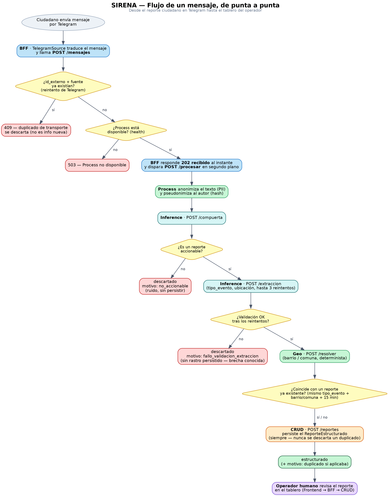

# SIRENA

### Sistema de Interpretación de Reportes de Emergencia y Necesidades Automatizado


Proyecto de curso — **Desarrollo de Proyectos de Inteligencia Artificial**, Universidad Autónoma de Occidente (UAO).

---

## Descripción del proyecto

**SIRENA** apoya al Puesto de Mando Unificado (PMU) de Santiago de Cali en la gestión de emergencias, tomando mensajes ciudadanos crudos (hoy, por Telegram) y convirtiéndolos en registros estructurados que un operador humano puede revisar rápidamente: qué tipo de evento es, qué servicio de respuesta se necesita y dónde ocurre.

El sistema nace del reto real que dejó la tragedia del 10 de agosto en Cali: durante una emergencia masiva, los reportes ciudadanos llegan en texto libre, dispersos y sin estructura, lo que hace lento y propenso a errores el trabajo manual de triaje. SIRENA usa un modelo de lenguaje (GPT-OSS 20B vía Groq) en dos etapas — primero decide si un mensaje amerita procesarse, luego extrae qué pasó y dónde — combinado con un resolutor geográfico determinista que nunca inventa una ubicación.

Un principio de diseño gobierna todo el sistema: **SIRENA es un copiloto, nunca un decisor.** Estructura hechos para que un humano decida; nunca valora gravedad, nunca prioriza, nunca despacha recursos por sí mismo. Cada registro se presenta siempre junto al mensaje original (anonimizado) que lo produjo, para que el operador pueda verificar la fuente.

## Arquitectura del sistema

SIRENA está compuesto por 5 microservicios independientes (cada uno con su propio contrato HTTP, documentado en [`docs/CONTRATOS_SISTEMA.md`](docs/CONTRATOS_SISTEMA.md)) más una interfaz de operador:

| Servicio | Puerto | Responsabilidad |
|---|---|---|
| **BFF** | 8000 | Puerta de entrada: recibe mensajes de las fuentes (Telegram), expone la API que consume el Frontend, hace de proxy hacia CRUD |
| **Process** | 8002 | Orquesta el pipeline: anonimiza, llama a Inference y Geo, detecta posibles duplicados, persiste el resultado |
| **Inference** | 8003 | Llama al LLM (Groq · GPT-OSS 20B) en dos etapas: compuerta de accionabilidad + extracción estructurada |
| **Geo** | 8004 | Resuelve una ubicación en texto libre a barrio/comuna de forma determinista (gazetteer propio + respaldo Nominatim), sin usar el LLM |
| **CRUD** | 8001 | Único servicio que toca la base de datos (SQLite); persiste y consulta los reportes estructurados |
| **Frontend** | 8501 | Tablero Streamlit donde el operador humano revisa, filtra y corrige los reportes |

Cada servicio habla con los demás únicamente por HTTP, usando URLs inyectadas por variable de entorno — nunca hardcodeadas — lo que permite reemplazar cualquier servicio real por un mock durante el desarrollo sin tocar el código de quien lo consume.

> 🚧 *Diagrama de arquitectura pendiente — el equipo está definiendo la herramienta para generarlo (posiblemente Archify). Se agrega aquí en cuanto esté listo.*

## Flujo de un mensaje, de punta a punta

Un mensaje ciudadano recorre el sistema en varias etapas, con puntos de decisión explícitos en cada una — un mensaje nunca se descarta por accidente, y un posible duplicado de contenido **nunca se pierde**, solo se marca:

1. El ciudadano escribe en Telegram; `TelegramSource` (BFF) lo traduce y llama `POST /mensajes`.
2. BFF verifica que no sea un reintento exacto (`fuente` + `id_externo`) y que Process esté disponible; responde `202` de inmediato y dispara el procesamiento en segundo plano (patrón *fire-and-forget*, el cliente nunca espera el pipeline completo).
3. Process anonimiza el texto (elimina PII) y pseudonimiza al autor (hash irreversible).
4. Inference decide si el mensaje es **accionable**; si no lo es, se descarta como ruido (no se persiste).
5. Si es accionable, Inference extrae `tipo_evento` y la ubicación en texto libre; si falla la validación tras 3 reintentos, se descarta.
6. Geo resuelve esa ubicación a barrio/comuna de forma determinista.
7. Process busca un posible duplicado de **contenido** (mismo tipo de evento, misma zona, dentro de una ventana de 15 minutos) — si lo encuentra, el reporte se persiste igual, solo queda marcado como corroboración.
8. CRUD persiste el registro estructurado.
9. El operador humano lo revisa en el tablero.



## Stack tecnológico

| Categoría | Herramientas |
|---|---|
| Lenguaje y gestor de paquetes | Python 3.12+, [uv](https://docs.astral.sh/uv/) (workspace de 5 servicios + paquete compartido + frontend) |
| Framework web | FastAPI, Pydantic |
| Modelo de lenguaje | GPT-OSS 20B (`openai/gpt-oss-20b`) vía [Groq](https://groq.com/) API |
| Interfaz de operador | Streamlit |
| Base de datos | SQLite |
| Pruebas y calidad | pytest, Ruff (lint + formato), pre-commit |
| Seguimiento de experimentos | MLflow |
| Contenedores | Docker, Docker Compose |
| Control de versiones | Git, Gitflow (`main` ← `develop` ← `feature/*`) |

## Instalación y ejecución local

Requisitos: Python 3.12+ y [uv](https://docs.astral.sh/uv/getting-started/installation/) instalados.

```bash
# 1. Clonar el repositorio
git clone https://github.com/Juanxo17/pmu-structured-extraction.git
cd pmu-structured-extraction

# 2. Instalar dependencias, el modelo de spaCy y los hooks de pre-commit
make install

# 3. Configurar variables de entorno
cp .env.example .env
# Completar GROQ_API_KEY en .env (https://console.groq.com/keys)

# 4. Levantar cada servicio en una terminal distinta
make run-crud
make run-geo
make run-inference
make run-process
make run-bff
make run-frontend
```

El Frontend queda disponible en `http://localhost:8501`.

## Ejecución con Docker

```bash
docker compose up --build
```

Esto levanta los 5 microservicios, el Frontend y MLflow, cada uno en su propio contenedor:

| Servicio | URL local |
|---|---|
| BFF | http://localhost:8000 |
| CRUD | http://localhost:8001 |
| Process | http://localhost:8002 |
| Inference | http://localhost:8003 |
| Geo | http://localhost:8004 |
| Frontend | http://localhost:8501 |
| MLflow | http://localhost:5000 |

La variable `GROQ_API_KEY` debe estar definida en el `.env` de la raíz antes de levantar los contenedores.

## Estructura del repositorio

```
pmu-structured-extraction/
├── backend/
│   ├── bff/          # Puerta de entrada — recibe mensajes, expone la API del Frontend
│   ├── crud/          # Persistencia — único servicio que toca la base de datos
│   ├── process/        # Orquestador del pipeline
│   ├── inference/       # Llamadas al LLM (Groq)
│   └── geo/           # Resolución geográfica determinista
├── common/sirena-schema/    # Esquema Pydantic compartido por todos los servicios
├── frontend/           # Tablero Streamlit del operador
├── tests/             # Pruebas unitarias, un directorio por servicio
├── docs/
│   ├── CONTRATOS_SISTEMA.md   # Contrato HTTP de cada endpoint
│   ├── diagramas/         # Diagramas de arquitectura y flujo (este README)
│   └── propuesta/         # Propuesta formal del proyecto
├── eval-prompt/          # Corpus, anotación y evaluación del modelo
├── config/ontologia.yaml    # Taxonomía de tipo_evento / servicio_de_respuesta (ERE de Cali)
├── docker-compose.yml
└── Makefile
```

## Pruebas y calidad

```bash
make lint           # Ruff — calidad de código
make format-check   # Ruff — verifica estilo sin modificar archivos
make test            # pytest — corre toda la suite del workspace
```

Un Pull Request no se fusiona si `pytest` o `ruff` fallan (ver [`AGENTS.md`](AGENTS.md)).

## Equipo

| Integrante | Microservicio(s) a cargo |
|---|---|
| Julián Correa | CRUD, Geo |
| Sebastián Jiménez | Frontend |
| César Carabalí | BFF, Process |
| Juan Plata | Inference |

## Gestión del proyecto

Tablero Kanban (GitHub Projects): [github.com/users/Juanxo17/projects/1/views/1](https://github.com/users/Juanxo17/projects/1/views/1)
